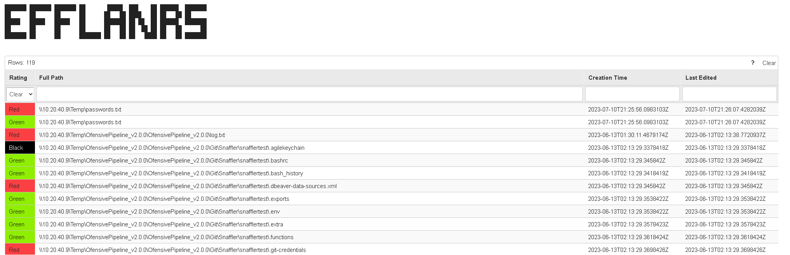

# Efflanrs - Snaffler GUI
```
███████ ███████ ███████ ██       █████  ███    ██ ██████  ███████
██      ██      ██      ██      ██   ██ ████   ██ ██   ██ ██
█████   █████   █████   ██      ███████ ██ ██  ██ ██████  ███████
██      ██      ██      ██      ██   ██ ██  ██ ██ ██   ██      ██
███████ ██      ██      ███████ ██   ██ ██   ████ ██   ██ ███████
```

## What is it for?

Efflanrs is a Python script to turn your Snaffler "delicious candy needles" into a nice searchable and sortable interface.
TL:DR it is a GUI for Snaffler output.

[Snaffler](https://github.com/SnaffCon/Snaffler)
"Snaffler is a tool for **pentesters** and **red teamers** to help find delicious candy needles (creds mostly, but it's flexible) in a bunch of horrible boring haystacks (a massive Windows/AD environment)."

## Features
- Parse Snaffler JSON
- Parse Snaffler Standard Out
- Output to a (nice-ish) HTML view that can be searched through, sorted, or filtered.


## Screenshots


## Setup

Python 3
```
pip install -r requirements.txt
```

## Usage

Usage is simple, provide a Snaffler Standard output log or JSON.

```
python3 snaffmap.py snaffler.output
```

```
python3 snaffmap.py snaffler.json
```

```
python3 snaffmap.py "./example data/snaffler.json"
.,:::::: .-:::::'.-:::::' :::      :::.    ::.    :::.  :::::::.. .::::::.:
;;;;'''' ;;;'''' ;;;''''  ;;;      ;;`;;   ;;;;,  `;;; ;;;;``;;;;;;;`    ``
 [[cccc  [[[,,== [[[,,==  [[[     ,[[ '[[,  [[[[[. '[[  [[[,/[[[''[==/[[[[,
 $$      `$$$'`` `$$$'``  $$'    c$$$cc$$$c $$$ 'Y$c$$   $$$$$$c   '''    $
888oo,__  888     888   o88oo,.__888   888,888    Y88  888b '88bo,88b    dP
M''''YUM   'MM,    'MM,  ''''YUMM YMM   ''` MMM     YMMMMMMM   'W'  'YMmMY'
###############################################
Great, looks like you specified a JSON file ...
Here we go!
###############################################
 * Serving Flask app 'snaffmap'
 * Debug mode: off
WARNING: This is a development server. Do not use it in a production deployment. Use a production WSGI server instead.
 * Running on http://127.0.0.1:5000
```

## Project Status
Project is: _always in progress_


## TODO

- Add a button to export to static HTML

## Acknowledgements
Credit goes here:
- This project was inspired by an internal tool idea snaffmap
- Many thanks to [Snaffler](https://github.com/SnaffCon/Snaffler), keep on Snaffling
- Feabell for the original Flask templating

## Contact

[CptWin](https://github.com/cptwin)

## License

GNU GPL Version 3

¯_(ツ)_/¯

I just copied the Snaffler one